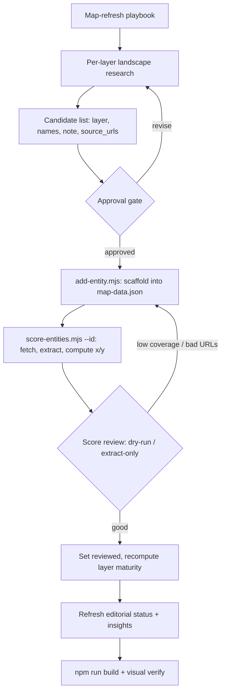

# feat: Refresh the Agent-Era Infrastructure Map with new players

## Summary

The Agent-Era Infrastructure Map (`/map`) scores 33 players across five layers
on openness and distribution. Its data was last scored 2026-03-04 — roughly
three months stale in a landscape that moves monthly. This plan does two things:
it builds **repeatable tooling** to identify and add new players with low
friction, and it **runs that tooling once** to refresh the dataset with newly
emerged players.

Identification is agent-assisted: a documented research pass scans each layer for
players that have emerged or were missed, proposes candidates with sources, and
surfaces them for approval before anything lands in the data. The existing
deterministic scoring pipeline (`scripts/score-entities.mjs`) handles placement —
this work only feeds it well-formed entities and editorial copy.

---

## Problem Frame

Adding a player today is entirely manual: hand-edit `data/map-data.json` to
append an entity object (minting a UUID by hand), then run the scorer. There is
no scaffold, no validation, and no documented method for deciding *which* players
belong. That friction is why the data has gone stale. The map is editorial — the
value is in curating the right players and writing sharp `note` copy — so the
goal is not to automate curation away, but to make the mechanical parts
(scaffolding, validation, scoring, publishing) fast and safe, and to give the
research pass a repeatable shape.

Two facts from the codebase shape every decision below:

- `src/components/map/AgentInfraMap.jsx` imports `data/map-data.json` directly.
  An entity renders only if its `layer` exactly matches an existing layer `key`
  and `current_x`/`current_y` fall in 0–100. Entity color comes from the layer.
- Scoring is deterministic by design (LLM extracts cited signals, code computes
  the number). That property must be preserved — new tooling supplies
  `source_urls` and metadata only; it never picks a score.

---

## Requirements

- R1. A repeatable CLI tool scaffolds a new entity into `data/map-data.json` with
  a valid shape (minted `id`, validated `layer`, required fields, timestamps) and
  supports a dry-run.
- R2. A documented playbook defines the agent-assisted identification method:
  per-layer scan criteria, candidate schema, dedup against the current roster,
  source-URL requirements, the approval gate, and the add → score → publish
  steps.
- R3. One identification pass produces an approved set of new players, each with
  a layer, names, draft `note`, and 2–3 authoritative `source_urls`, deduped
  against the existing 33 entities.
- R4. Approved players are added and scored through the existing pipeline; every
  added entity ends with `current_x`/`current_y` in 0–100 and acceptable signal
  coverage.
- R5. Editorial layer `status`/`status_note` and the `insights` array are
  reviewed and updated to reflect the new roster, passing the project voice bar.
- R6. The site builds and the map renders the new players in the correct layers
  and positions with no console errors.

---

## High-Level Technical Design

The refresh is a staged pipeline with two human gates (candidate approval and
score review). The tooling automates the mechanical stages; the gates keep
curation and copy under editorial control.



The two existing scripts (`score-entities.mjs`, and the obsolete
`seed-source-urls.mjs` as a code model) are unchanged in behavior; the new
`add-entity.mjs` sits upstream of scoring, and the playbook wraps the whole flow.

---

## Key Technical Decisions

- KTD1. Identification is agent-assisted web research with a human approval gate
  — not automated crawling, and not limited to community "Suggest a company"
  issues. The map's value is curation; a research pass plus approval keeps
  quality high while making the method repeatable. Community issues remain a
  separate intake path (deferred).
- KTD2. `add-entity.mjs` is modeled on `scripts/seed-source-urls.mjs`:
  read-modify-write against `data/map-data.json`, plain ESM `.mjs` with Node
  built-ins (`node:fs`, `node:path`, `node:util` `parseArgs`), a `--dry-run`
  flag, and no new runtime dependencies. `id` is minted with
  `crypto.randomUUID()`. This keeps the scripts directory consistent and the
  data file the single source of truth.
- KTD3. Score only newly added entities by default; a full re-score of the
  existing 33 is deferred. Evidence for established players is relatively stable,
  per-entity scoring is cheaper and faster, and layer maturity still recomputes
  across all `reviewed` entities (new ones included) on any scoring run. The
  freshness tradeoff is explicit and revisitable.
- KTD4. `reviewed` is treated as the maturity-inclusion flag, not a render gate.
  The live component renders entities regardless of `reviewed`; only
  `computeLayerMaturity` filters on it. New entities are set `reviewed: true`
  after the score-review gate. A genuine "hold-for-review / hide from chart" gate
  would require a component filter change and is deferred.
- KTD5. Determinism is preserved end to end. The scaffold never writes
  `current_x`/`current_y`; those come only from the existing deterministic
  scorer. Re-running scoring on identical evidence must yield identical scores.

---

## Output Structure

New and touched files (additions marked `+`):

```text
scripts/
  add-entity.mjs          + entity scaffold CLI (read-modify-write JSON)
  add-entity.test.mjs     + node:test for pure helpers (repo's first test)
  score-entities.mjs        (unchanged; invoked per new entity)
docs/
  map-refresh-playbook.md + repeatable identify → add → score → publish method
data/
  map-data.json             (new entities, refreshed layer status + insights)
```

---

## Implementation Units

### U1. Entity-add scaffold script

**Goal:** A repeatable CLI that scaffolds a well-formed entity into
`data/map-data.json`, so adding a player no longer means hand-editing JSON or
hand-minting UUIDs.

**Requirements:** R1

**Dependencies:** none

**Files:**
- `scripts/add-entity.mjs` (create)
- `scripts/add-entity.test.mjs` (create)
- `data/map-data.json` (read/write target)

**Approach:** Mirror `scripts/seed-source-urls.mjs` — load the JSON, mutate,
write back with a trailing newline and refreshed `exported_at`. Accept entity
fields via flags (`--layer`, `--short-name`, `--full-name`, `--note`,
`--source-url` repeatable) and a `--from <file>` mode that reads a candidates
array for batch adds. For each entity: mint `id` with `crypto.randomUUID()`;
validate `layer` against the existing layer `key`s (reject unknown — an unknown
layer makes the entity silently undisplayable per the component's filter);
require a non-empty `full_name`, `short_name`, and at least one `source_url`;
set `current_x`/`current_y` to `null`, `reviewed` to `false`, and
`created_at`/`updated_at` to now. Dedup against existing entities on
`full_name` + `layer` and refuse duplicates unless `--force`. Lint `note` for
spaced em dashes (`word — word`) and warn, per the voice rule. Support
`--dry-run` (print the entity that would be added, write nothing). Optionally
chain scoring by printing the exact follow-up command
(`node scripts/score-entities.mjs --id <minted-id>`) rather than invoking it, to
keep the score-review gate explicit.

**Patterns to follow:** `scripts/seed-source-urls.mjs` (read-modify-write,
console summary lines like `SEEDED`/`EXISTS`/`SKIP`), `scripts/score-entities.mjs`
(`parseArgs` flag definitions, `--dry-run` convention, trailing-newline write).

**Execution note:** Write the pure helpers (id mint, layer validation, dedup,
note lint) test-first — they are the breakable logic and the rest is I/O glue.

**Test scenarios** (`scripts/add-entity.test.mjs`, run with `node --test` — this
introduces the repo's first automated test, zero new dependencies):
- Minting: produces a non-empty string `id`; two calls produce different ids.
- Layer validation: a known key (`payments`) is accepted; an unknown key
  (`storage`) is rejected with a clear error naming the valid keys.
- Dedup: an entity matching an existing `full_name` + `layer` is refused; the
  same `full_name` under a *different* layer is allowed (the data already has
  "A2A Agent Cards" in two layers).
- Required fields: missing `full_name`, missing `short_name`, or empty
  `source_urls` each fail validation with a specific message.
- Note voice lint: `"Open spec — vendor adds control"` (spaced em dash) is
  flagged; `"Open spec—vendor adds control"` passes.
- Dry-run: `--dry-run` leaves `data/map-data.json` byte-for-byte unchanged
  (assert against a temp fixture copy, not the real file).
- Scaffold shape: a successfully added entity has `current_x === null`,
  `current_y === null`, `reviewed === false`, and ISO `created_at`/`updated_at`.

**Verification:** `node scripts/add-entity.test.mjs` (or `node --test scripts/`)
passes. A manual `--dry-run` add prints a correctly shaped entity and writes
nothing.

---

### U2. Map-refresh research playbook

**Goal:** A durable, repeatable method for the agent-assisted identification pass,
so future refreshes follow the same shape instead of being improvised.

**Requirements:** R2

**Dependencies:** U1 (the playbook references the scaffold command)

**Files:**
- `docs/map-refresh-playbook.md` (create)

**Approach:** Document the end-to-end refresh as the staged flow in the
High-Level Technical Design. Cover: (1) per-layer scan criteria — what qualifies
as a player (a real, usable deployment pattern in the agent stack, not vaporware
or a feature of an already-listed player), framed per layer (compute, protocols,
discovery, identity, payments); (2) the candidate schema (layer, `short_name`,
`full_name`, draft `note`, 2–3 authoritative `source_urls`); (3) dedup
instructions against the current roster, including the "same name, different
layer" case; (4) source-URL quality bar (official docs, specs, or primary
announcements — the scorer fetches up to 5, strips HTML, and cites them);
(5) the approval gate; (6) the add → score → review → publish steps with exact
commands; (7) the voice bar for `note` and `insights` copy (link `VOICE.md`,
require the humanizer pass); (8) the `reviewed` semantics from KTD4 so future
runs aren't surprised. Keep it operational and concise — a checklist a future
session can execute.

**Patterns to follow:** Existing `docs/` prose style; reference but do not
duplicate the README "Map scoring" section.

**Test scenarios:** Test expectation: none — documentation unit with no
behavioral change.

**Verification:** A reader unfamiliar with the project can follow the playbook to
go from "what's missing" to "scored, published players" without reading the
script source. Cross-check that every command in the playbook matches the actual
flags in `add-entity.mjs` and `score-entities.mjs`.

---

### U3. Identify candidate new players (one pass)

**Goal:** Produce an approved set of new players to add, via agent-assisted
landscape research executed against the playbook.

**Requirements:** R3

**Dependencies:** U2

**Files:**
- (working artifact) a candidates list — either a temporary
  `data/map-candidates.json` consumed by `add-entity.mjs --from`, or an inline
  approved list; not a committed deliverable

**Approach:** Execute the playbook's research stage. For each of the five layers,
scan the current landscape for players that have emerged since the last refresh
or were missed, using web research. Draft each candidate with layer,
`short_name`, `full_name`, a claim-first `note` in the project voice, and 2–3
authoritative `source_urls`. Dedup against the existing 33 entities. Present the
candidate set grouped by layer with a one-line rationale per candidate and
surface it for approval; revise on feedback. Do not add anything to
`data/map-data.json` in this unit — the output is the approved list.

**Execution note:** This is research with a human gate. Present candidates and
get explicit approval before U4 mutates the data file. Quantity is a judgment
call surfaced at approval, not a fixed target — quality and fit over count.

**Patterns to follow:** The existing entities' `note` register (e.g. "2.5B
devices, but Apple controls chip + App Store") — terse, specific, states the
tension. `VOICE.md` voice rules.

**Test scenarios:** Test expectation: none — research/curation unit. Quality is
gated by approval, not assertions.

**Verification:** An approved candidate list exists; every candidate has a valid
target layer, ≥1 (ideally 2–3) reachable `source_urls`, a voice-passing draft
`note`, and is not a duplicate of an existing entity.

---

### U4. Add and score approved players

**Goal:** Land the approved players in the data file and score them through the
existing deterministic pipeline, ending with valid on-chart positions.

**Requirements:** R4

**Dependencies:** U1, U3

**Files:**
- `data/map-data.json` (modify — new entities and their scores)

**Approach:** Run `add-entity.mjs` for the approved candidates (batch `--from`
or per-entity). For each new entity, run `node scripts/score-entities.mjs --id
<id>`; use `--extract-only` and/or `--dry-run` first to inspect extracted
signals and catch low-coverage cases before writing. When the scorer reports low
coverage or all URLs failed, fix `source_urls` (better/more reachable sources)
and re-run — never hand-set a score (KTD5). Once scores look right, set the new
entities' `reviewed` to `true` so they count in layer maturity (KTD4), then run
a scoring pass that recomputes layer maturity across the affected layers. Confirm
every new entity has `current_x`/`current_y` in 0–100.

**Patterns to follow:** `score-entities.mjs` CLI contract (`--id`, `--layer`,
`--dry-run`, `--extract-only`); its serial loop and per-entity `SCORE`/`written`
output.

**Test scenarios:**
- Coverage: each new entity scores with acceptable signal coverage; any entity
  the scorer flags `low_coverage` (>40% null signals) is either improved via
  better sources or explicitly accepted with a noted reason.
- Range: every new entity's `current_x` and `current_y` are integers in 0–100
  (the component plots `v/100` and assumes that range).
- Determinism: re-running `score-entities.mjs --id <id>` on unchanged source
  pages yields the same `current_x`/`current_y` (sanity check on KTD5).
- Maturity recompute: after `reviewed: true`, affected layers'
  `computed_status`/`computed_status_note` reflect the new point set without
  errors.

**Verification:** `data/map-data.json` contains the new entities with non-null,
in-range scores and `reviewed: true`; a scoring run over the affected layers
completes with `Errors: 0`.

---

### U5. Refresh editorial layer status and insights

**Goal:** Update the hand-authored editorial signal — layer `status`/`status_note`
and the `insights` cards — so the narrative matches the refreshed roster.

**Requirements:** R5

**Dependencies:** U4

**Files:**
- `data/map-data.json` (modify — `layers[].status`, `layers[].status_note`,
  `insights[]`)

**Approach:** Review each layer's displayed `status`/`status_note` (human values,
authoritative over `computed_status`) against the new point distribution and the
scorer's recomputed `computed_status` from U4; update where the new players shift
the picture. Review the four `insights` cards (e.g. "Identity has no middle",
"The diagonal is crowded") and revise, add, or retire so they still hold given
the new entities. Leave `status_override`/`override_rationale` inert (currently
unread by any code) unless a change to that mechanism is explicitly wanted —
out of scope here. All new or edited copy follows `VOICE.md` and passes the
humanizer.

**Patterns to follow:** Existing `status_note` and `insights` copy register;
`VOICE.md`; the `insights` object shape (`id`, `title`, `body`, `color`,
`sort_order`, `active`).

**Test scenarios:** Test expectation: none — editorial copy unit. Quality is
gated by the voice/humanizer review below.

**Verification:** Each layer's `status_note` is consistent with where its players
now sit; insights make claims the refreshed data supports; all edited copy uses
spaceless em dashes, no format-describing or CTA phrasing, and passes the
humanizer.

---

### U6. Build, verify, and capture

**Goal:** Confirm the refreshed map renders correctly and capture the updated
visual.

**Requirements:** R6

**Dependencies:** U4, U5

**Files:**
- (build output / verification) `npm run build`
- `public/img/og/map.png` (regenerate if the visual changed materially)
- `README.md` (touch only if the refresh changed entity counts cited anywhere)

**Approach:** Run `npm run build` and confirm a clean build (the JSON is inlined
into the React island at build time, so a malformed entity surfaces here). Load
the map (`npm run dev` or preview) and verify the new players appear as dots in
the correct layer color and at sensible positions, tooltips show the right
`full_name`/`note`, and the browser console is clean — entities with a bad
`layer` would be silently dropped, so confirm the expected count is visible per
layer. If the new players change the map's look enough to matter for sharing,
regenerate the OG image via the existing capture tooling
(`scripts/capture-og.sh` / `scripts/screenshot.sh`). Update any
entity-count references in `README.md` if present.

**Patterns to follow:** `scripts/capture-og.sh`, `scripts/screenshot.sh`, and
the new-project checklist's image/build verification steps (for the OG capture
convention).

**Test scenarios:**
- Build: `npm run build` exits 0 with no errors.
- Render: each newly added entity is visible on the chart in its layer's color;
  per-layer visible counts match the data (no silent drops from layer/key or
  range issues).
- Tooltips: a spot-checked new entity shows correct `full_name` and `note`.
- Console: no runtime errors when interacting with the map (filter buttons,
  hovers).

**Verification:** Clean production build; new players visible and correct in the
rendered map; OG image regenerated if the visual materially changed.

---

## Scope Boundaries

### In scope
- Reusable `add-entity.mjs` scaffold and its tests.
- The `docs/map-refresh-playbook.md` repeatable method.
- One agent-assisted identification pass and the resulting adds + scores.
- Editorial refresh of layer status and insights for the new roster.
- Build and visual verification.

### Deferred to Follow-Up Work
- Full re-score of the existing 33 entities (KTD3) — separate run if/when their
  evidence is judged stale.
- A real `reviewed`-based hide gate in `AgentInfraMap.jsx` (KTD4) — would let
  unreviewed entities be staged without showing on the chart.
- Programmatic intake of community "Suggest a company" / "Challenge a score"
  GitHub issues into the candidate flow.
- Cleanup of stale `*_SUPABASE_*` vars in `.env.example` (dead config) and
  annotation/retirement of the Supabase-era plans in `docs/plans/` (filename
  `map-entities.json`, `rubric` key, DB writes all drifted from reality).
- Automating OG regeneration in CI.

### Outside this project's identity
- Changing the scoring rubric, signal set, or weights in `score-entities.mjs`.
- Adding or removing map layers, or changing the openness/distribution axes.
- Reintroducing any LLM-picks-a-number scoring step.

---

## Risks & Dependencies

- **Source reachability.** The scorer fetches live URLs (10s timeout, 5 max);
  candidates behind JS-heavy pages, logins, or aggressive bot blocking yield low
  coverage. Mitigation: prefer primary docs/specs/announcements; inspect with
  `--extract-only` before committing scores; supply backup URLs.
- **Layer-key mismatch silently hides entities.** A typo'd `layer` makes an
  entity vanish from the chart with no error. Mitigation: U1 validates `layer`
  against existing keys and refuses unknowns.
- **Voice drift in entity/insight copy.** New `note` and `insights` text is
  brand-facing. Mitigation: U1 lints em-dash spacing; U3/U5 require `VOICE.md` +
  humanizer review.
- **First test in the repo.** U1 introduces `node:test`. Mitigation: built-in
  runner, no new dependencies, scoped to pure helpers; the `--dry-run`
  convention remains the integration check.
- **`reviewed` semantics confusion.** The render-vs-maturity split (KTD4) is
  non-obvious. Mitigation: documented in the playbook and KTD4.
- **Dependency on `ANTHROPIC_API_KEY`.** Scoring (U4) requires it in `.env`;
  the script hard-exits without it. No other config is needed.

---

## Sources & Research

- `scripts/score-entities.mjs` — deterministic scoring pipeline (signal schemas,
  weights, CLI flags, evidence fetch limits, layer maturity computation).
- `scripts/seed-source-urls.mjs` — read-modify-write JSON model for the new
  scaffold (now obsolete in purpose).
- `src/components/map/AgentInfraMap.jsx` — direct JSON import; render constraints
  (layer-key match, 0–100 range, layer-derived color; ignores `reviewed`).
- `src/pages/map/index.astro` — page that mounts the island.
- `data/map-data.json` — live schema and the 33-entity / 5-layer roster.
- `README.md` "Map scoring" section — public description of the pipeline.
- `docs/brainstorms/2026-03-03-open-map-data-brainstorm.md`,
  `docs/plans/2026-03-04-refactor-deterministic-entity-scoring-plan.md`,
  `docs/plans/2026-03-03-feat-scoring-pipeline-plan.md` — design rationale
  (partly drifted; trust the code).
- `VOICE.md`, `CLAUDE.md` — voice rules for entity and insight copy.
